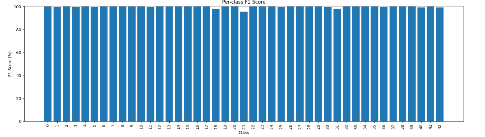
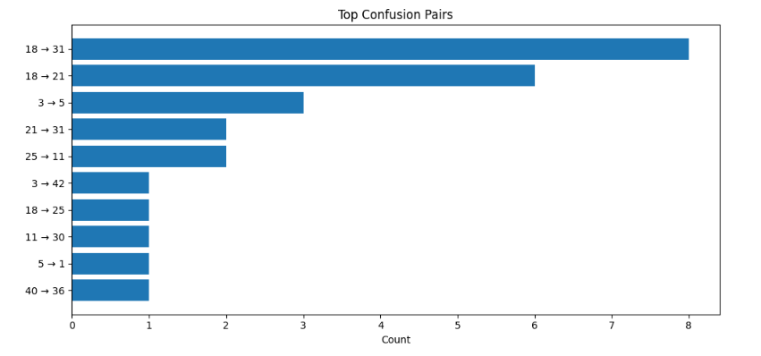
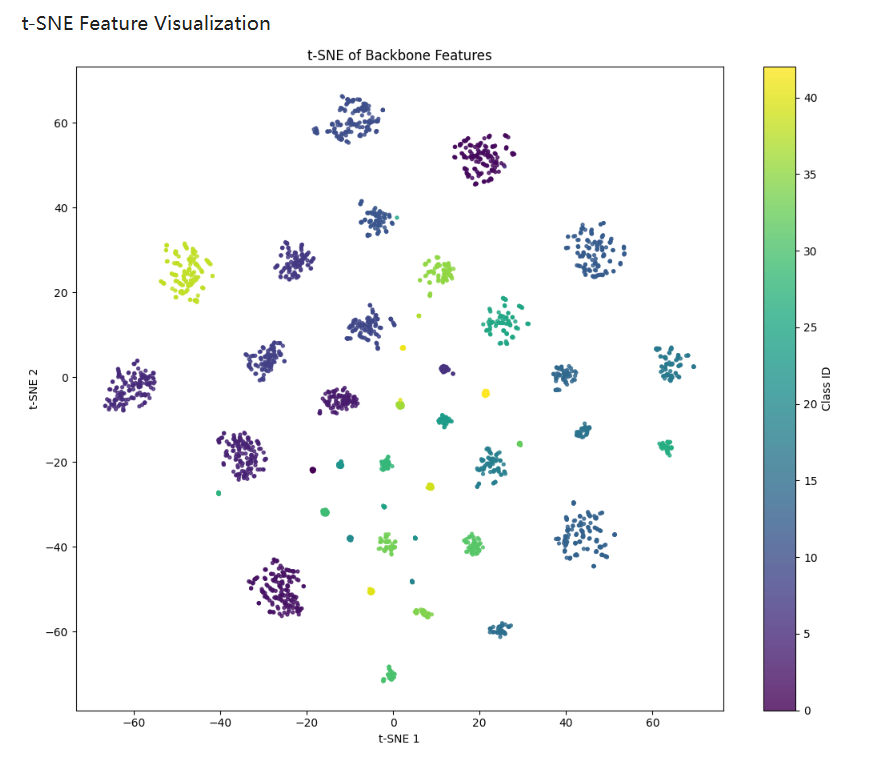

[English](README.md) | [简体中文](README_CN.md)

# Two-Stage Robust Traffic Sign Classification

A PyTorch/timm project for robust traffic-sign classification on **GTSRB**, with 7 backbones, cross-dataset fine-tuning, weighted soft-voting ensembles, and robustness evaluation.

## Quick Start

### Install

```bash
git clone https://github.com/YOUR_USERNAME/YOUR_REPOSITORY.git
cd YOUR_REPOSITORY

python -m venv .venv
source .venv/bin/activate      # Linux / macOS
# .venv\Scripts\activate       # Windows

pip install -r requirements.txt
```

Python 3.10+ is recommended.

### Which script should I run?

| Goal | Script |
|---|---|
| Train a robust backbone on GTSRB | `src/stage1.py` |
| Fine-tune on another traffic-sign dataset | `src/stage2.py` |
| Evaluate one Stage 1 model | `evaluation/test.py` |
| Evaluate / ensemble multiple Stage 1 models | `evaluation/ensemble_evaluation.py` |

---

## Supported Backbones

| Key | timm model |
|---|---|
| `convnext` | `convnextv2_base.fcmae_ft_in22k_in1k` |
| `swin` | `swinv2_small_window16_256.ms_in1k` |
| `eva02` | `eva02_base_patch14_224.mim_in22k` |
| `effnet` | `tf_efficientnetv2_s.in21k_ft_in1k` |
| `caformer` | `caformer_s18.sail_in1k` |
| `maxvit` | `maxvit_tiny_rw_224.sw_in1k` |
| `coatnet` | `coatnet_0_rw_224.sw_in1k` |

---

## Original Pretrained Weights

These are the upstream timm weights hosted on Hugging Face.

| Backbone | Direct download |
|---|---|
| ConvNeXt V2 | [model.safetensors](https://huggingface.co/timm/convnextv2_base.fcmae_ft_in22k_in1k/resolve/main/model.safetensors?download=true) |
| Swin V2 | [model.safetensors](https://huggingface.co/timm/swinv2_small_window16_256.ms_in1k/resolve/main/model.safetensors?download=true) |
| EVA-02 | [model.safetensors](https://huggingface.co/timm/eva02_base_patch14_224.mim_in22k/resolve/main/model.safetensors?download=true) |
| EfficientNetV2 | [model.safetensors](https://huggingface.co/timm/tf_efficientnetv2_s.in21k_ft_in1k/resolve/main/model.safetensors?download=true) |
| CAFormer | [model.safetensors](https://huggingface.co/timm/caformer_s18.sail_in1k/resolve/main/model.safetensors?download=true) |
| MaxViT | [model.safetensors](https://huggingface.co/timm/maxvit_tiny_rw_224.sw_in1k/resolve/main/model.safetensors?download=true) |
| CoAtNet | [model.safetensors](https://huggingface.co/timm/coatnet_0_rw_224.sw_in1k/resolve/main/model.safetensors?download=true) |

---

## Trained Checkpoints

https://huggingface.co/Shijunqiang/TrafficSignClassification

---

## Dataset Layout

### GTSRB

```text
data/
└── GTSRB/
    ├── Train/
    │   ├── 0/
    │   ├── 1/
    │   └── ...
    ├── Test/
    └── Test.csv
```

Official benchmark: [GTSRB](https://www.kaggle.com/datasets/meowmeowmeowmeowmeow/gtsrb-german-traffic-sign)

### Stage 2 target dataset

Stage 2 expects a single-label ImageFolder-style dataset:

```text
data/
└── Newtrain/
    ├── class_a/
    ├── class_b/
    └── class_c/
```

The target dataset does **not** need to use the same 43 classes as GTSRB. Stage 2 reuses the Stage 1 backbone and creates a new classifier for the target number of classes.

For detection datasets, crop traffic-sign bounding boxes into classification images first.

---

## Usage

### 1. Train Stage 1 on GTSRB

```bash
MODEL_KEY=coatnet \
GTSRB_ROOT=./data/GTSRB \
STAGE1_OUT_DIR=./outputs/stage1_coatnet \
python src/stage1.py
```

Use a locally downloaded upstream weight:

```bash
MODEL_KEY=convnext \
CONVNEXT_WEIGHTS=./weights/pretrained/convnextv2_base.safetensors \
GTSRB_ROOT=./data/GTSRB \
python src/stage1.py
```

Typical outputs:

```text
<model>_stage1_best.pth
<model>_stage1_last.pth
<model>_stage1_meta.json
<model>_stage1_history.json
```

### 2. Fine-tune Stage 2 on another traffic-sign dataset

```bash
MODEL_KEY=eva02 \
STAGE2_TRAIN_DIR=./data/Newtrain \
STAGE1_ROOT=./weights/stage1 \
STAGE2_OUT_DIR=./outputs/stage2_eva02 \
python src/stage2.py
```

### 3. Evaluate one model

```bash
STAGE1_CKPT=./weights/stage1/model_v1.1_convnext_gtsrb.pth \
STAGE1_META_JSON=./weights/stage1/model_v1.1_convnext_stage1_meta.json \
GTSRB_ROOT=./data/GTSRB \
python evaluation/test.py
```

### 4. Evaluate an ensemble

Equal weights:

```bash
SELECTED_MODELS=effnet,caformer,maxvit \
GTSRB_ROOT=./data/GTSRB \
STAGE1_MODEL_ROOT=./weights/stage1 \
python evaluation/ensemble_evaluation.py
```

Custom weights:

```bash
SELECTED_MODELS=effnet,caformer,maxvit \
ENSEMBLE_WEIGHTS_JSON='{"effnet":0.45,"caformer":0.35,"maxvit":0.20}' \
GTSRB_ROOT=./data/GTSRB \
STAGE1_MODEL_ROOT=./weights/stage1 \
python evaluation/ensemble_evaluation.py
```

---

## Evaluation

The evaluation pipeline provides:

- Accuracy / Macro-F1
- per-class metrics
- confusion matrix
- wrong / low-confidence samples
- t-SNE
- clean / blur / dark / JPEG / noise / fog / rain robustness tests

### Reported clean GTSRB result

| Metric | Score |
|---|---:|
| Accuracy | **99.7941%** |
| Macro Precision | **99.6782%** |
| Macro Recall | **99.7934%** |
| Macro F1 | **99.7329%** |
| Weighted F1 | **99.7944%** |

Test set: **12,630 images / 43 classes**

> Results depend on checkpoint selection, preprocessing, selected models and ensemble weights.







---

## Project Structure

```text
.
├── README.md
├── README_CN.md
├── requirements.txt
├── .gitignore
├── src/
│   ├── stage1.py
│   └── stage2.py
├── evaluation/
│   ├── test.py
│   └── ensemble_evaluation.py
└── assets/
    ├── per_class_f1.png
    ├── top_confusion_pairs.png
    └── tsne_features.png
```

---

## Reproducibility

- Keep Stage 1 metadata with each checkpoint.
- Record PyTorch / timm / Albumentations versions.
- Keep class-folder ordering unchanged.
- Keep training/evaluation seeds.
- Report the exact ensemble model subset and weights.

---

## Citation

```bibtex
@article{stallkamp2012man,
  title={Man vs. computer: Benchmarking machine learning algorithms for traffic sign recognition},
  author={Stallkamp, Johannes and Schlipsing, Marc and Salmen, Jan and Igel, Christian},
  journal={Neural Networks},
  volume={32},
  pages={323--332},
  year={2012},
  publisher={Elsevier}
}
```


    
